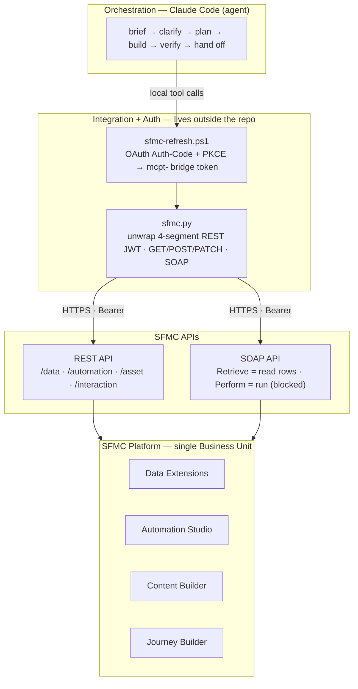
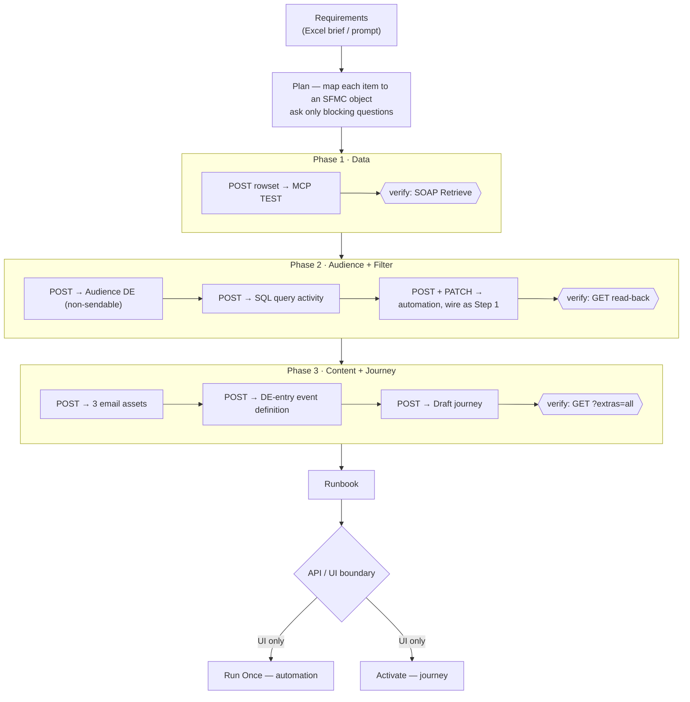
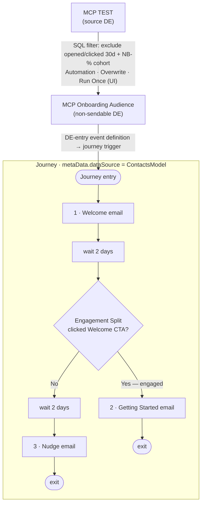

# Architecture — Programmatic SFMC Campaign Build

How the *Northbridge Onboarding* campaign was designed and assembled in Salesforce Marketing Cloud entirely through APIs (2026-06-03). Diagrams use **Mermaid** (GitHub renders them automatically). All identifiers here are object *names* only — no tenant, EID, or object IDs.

Companion docs: `CAMPAIGN-DESIGN-NOTES.md` (rationale + lessons), `MCP-Onboarding-Campaign-Runbook.md` (operational steps), `SFMC-Campaign-Brief-Template.xlsx` (intake template).

---

## 1. Build-time architecture (layers)

The agent orchestrates; an auth/integration layer (kept outside the repo) brokers tokens and HTTP; the SFMC APIs front the platform objects.

**Why auth sits outside the repo:** the live token and instance endpoints stay off a public repository while the in-repo docs stay generic.

---

## 2. Build sequence (method + the API/UI boundary)

Each object is created, then **read back and verified**, before moving on. The final two steps cross a hard platform boundary: the API can *build* but not *run/activate*.

**Pattern:** `build → read-back verify → proceed`. For unfamiliar JSON (e.g. the engagement split) the rule was *mirror an existing live object, don't guess*.

---

## 3. Runtime data flow (campaign once activated)

---

## 4. Key architectural decisions

| Decision | Reason |
|---|---|
| Auth + tooling **outside** the repo | keeps the live token and endpoints off a public repo |
| **Non-sendable** audience DE | a sendable SQL target throws *"could not build exclusion text"* |
| `metaData.dataSource = "ContactsModel"` on the journey | makes decision/engagement-split fields resolve |
| **REST-direct** rather than MCP tools | MCP tools bind at session start; they could not load mid-session |
| **Build via API, run/activate via UI** | platform limitation — the handoff (runbook) was designed around it |
| Cohort guard (`NB-%`) in the SQL | keeps stray/test rows out of the audience on every Overwrite |
| Read-back verification after every write | SOAP returns HTTP 200 even on failure; trust the read, not the status code |

---

## 5. Component inventory

| Layer | Component | Role |
|---|---|---|
| Orchestration | Claude Code agent | plans + drives the build |
| Auth | `sfmc-refresh.ps1` | OAuth PKCE refresh → bridge token |
| Auth | `sfmc.py` | derive REST JWT + thin REST/SOAP client |
| API | REST `/data` `/automation` `/asset` `/interaction` | create + read objects |
| API | SOAP `Retrieve` / `Perform` | read DE rows; run attempt |
| Platform | Data Extensions | source + filtered audience |
| Platform | Automation Studio | SQL filter automation |
| Platform | Content Builder | 3 onboarding emails |
| Platform | Journey Builder | Draft journey + entry event |
