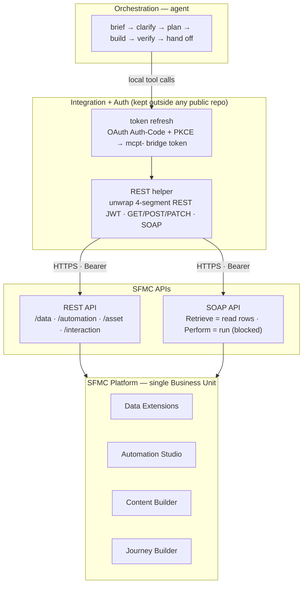
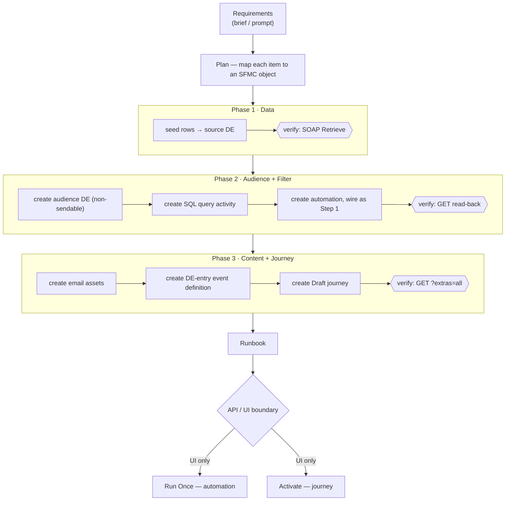
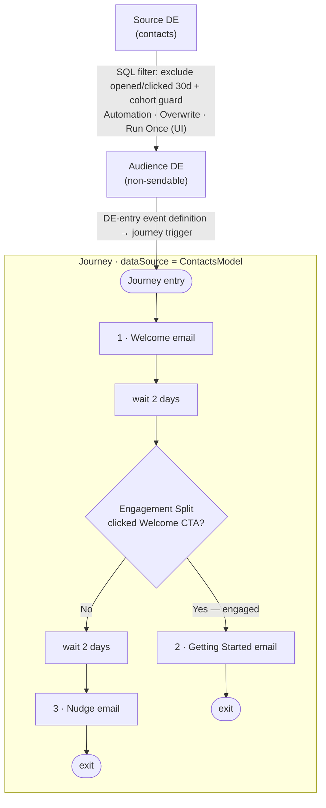

# SFMC MCP Library

**Operating Salesforce Marketing Cloud (SFMC) programmatically** through the Model Context Protocol (MCP) and the SFMC REST/SOAP APIs — a verified API knowledge base, reusable build & monitoring tooling, and a fully worked end-to-end campaign, assembled with Claude.

---

## Overview

This library captures everything needed to **build and operate SFMC entirely through APIs** — no manual UI clicking for the parts that can be automated. It exists because the SFMC API surface is full of non-obvious quirks (misleading errors, REST-vs-SOAP gaps, capability boundaries); this repo turns hard-won findings into a reusable playbook.

It contains three things:

1. **A verified API reference** — what works, what doesn't, and the exact payloads — for Data Extensions, Automation Studio, Content Builder, and Journey Builder.
2. **Reusable tooling & process** — an intake brief template, a build playbook, and a live monitoring dashboard.
3. **A worked example** — an email onboarding campaign built end-to-end via API (Data Extension → audience filter automation → emails → journey with an engagement split).

> **Note on identifiers:** All instance-specific values in this repo (tenant subdomain, enterprise ID, object IDs, endpoints) are shown as **placeholders** (`<TENANT>`, `<EID>`, `<REDACTED-ID>`). Configure your own instance before use.

---

## Capabilities at a glance

| Area | What's covered |
|------|----------------|
| **Data Extensions** | CRUD, field operations, sendable configuration (two-step create + PATCH), SOAP field mutation |
| **Automation Studio** | Build automations + SQL Query activities via REST; documented run/activation limits |
| **Content Builder** | HTML + AMPScript email assets with personalization |
| **Journey Builder** | DE-entry event definitions, decision/engagement splits, full journey graphs (Draft) |
| **Monitoring** | Live dashboard across DEs, automations, journeys, content, and engagement data views |
| **Auth** | OAuth (Auth-Code + PKCE) refresh mechanics and the MCP-bridge-vs-REST token distinction |

---

## Architecture

The build is layered: an orchestration agent drives an auth/integration layer, which brokers tokens and HTTP to the SFMC REST/SOAP APIs, which front the platform objects.

### Build sequence

Each object is created, then **read back and verified**, before moving on. The final two steps cross a hard platform boundary: the API can *build* but not *run/activate*.

### Runtime data flow (worked example)

📐 Full diagrams + design rationale: [`ARCHITECTURE.md`](ARCHITECTURE.md)

---

## Repository map

| File | What it is |
|------|------------|
| [`ARCHITECTURE.md`](ARCHITECTURE.md) | Architecture diagrams (Mermaid) + key design decisions |
| [`AUTOMATION-API-CAPABILITIES.md`](AUTOMATION-API-CAPABILITIES.md) | Verified Automation Studio API reference — what works / what's UI-only |
| [`CAMPAIGN-DESIGN-NOTES.md`](CAMPAIGN-DESIGN-NOTES.md) | Campaign design rationale + API lessons learned |
| [`MCP-Onboarding-Campaign-Runbook.md`](MCP-Onboarding-Campaign-Runbook.md) | The worked campaign: built objects + UI run/activate steps |
| [`JOURNEY-CONFIGURATION-SPEC.md`](JOURNEY-CONFIGURATION-SPEC.md) | Journey configuration specification |
| [`JOURNEY-CREATION-FINDINGS.md`](JOURNEY-CREATION-FINDINGS.md) | Journey creation findings (REST vs SOAP) |
| [`MCP_TEST_CASES.md`](MCP_TEST_CASES.md) | Test-case & use-case library for validating the integration |
| [`SFMC-Campaign-Brief-Template.xlsx`](SFMC-Campaign-Brief-Template.xlsx) | Reusable intake brief that maps 1:1 to SFMC objects |
| `Salesforce MCP + Claude Code Integration Guide.docx` | Setup & integration guide |

---

## Quickstart

1. **Connect.** Refresh the OAuth token (Auth-Code + PKCE). The MCP refresh yields an `mcpt-` *bridge* token valid for MCP tools; the **REST-usable platform JWT is the 4-segment token embedded inside it**. Token TTL ≈ 18 min — refresh immediately before a build and batch writes.
2. **Build.** Work in phases (Data → Audience + Filter → Content + Journey), reading back and verifying after every write. Mirror an existing live object's JSON rather than guessing. See [`CAMPAIGN-DESIGN-NOTES.md`](CAMPAIGN-DESIGN-NOTES.md) and [`AUTOMATION-API-CAPABILITIES.md`](AUTOMATION-API-CAPABILITIES.md).
3. **Hand off.** The API builds everything to "ready"; **running an automation (Run Once) and activating a journey are UI-only** — deliver a short runbook for those two clicks.
4. **Monitor.** Pull a live dashboard across DEs, automations, journeys, content, and 30-day engagement (Sent/Open/Click).

---

## Key lessons (the short version)

- **API can build, but not run/activate** — automation Run Once and journey publish are UI-only (the start endpoints reject; SOAP `Perform` returns `InvalidRequest`).
- **Target non-sendable DEs for SQL** — a sendable target throws *"could not build exclusion text."*
- **Journeys need `metaData.dataSource = "ContactsModel"`** for decision/engagement-split fields to resolve.
- **Read rows via SOAP `Retrieve`** — the REST DE rowset GET returns 404.
- **SOAP returns HTTP 200 even on failure** — always parse `<OverallStatus>`, trust the read-back not the status code.
- **Watch the misleading errors** — e.g. `length` vs `maxLength`, `EmailAddress` requiring explicit `length`.

Full detail in [`AUTOMATION-API-CAPABILITIES.md`](AUTOMATION-API-CAPABILITIES.md) and [`CAMPAIGN-DESIGN-NOTES.md`](CAMPAIGN-DESIGN-NOTES.md).

---

## Test cases

A structured validation suite (DE CRUD, field ops, sendable config, folder navigation, automation/journey querying, error handling, SOAP-vs-REST, performance) lives in [`MCP_TEST_CASES.md`](MCP_TEST_CASES.md).

---

*Maintained as an Accenture Canada AI Accelerators knowledge asset. Identifiers are redacted — bring your own SFMC instance configuration.*
